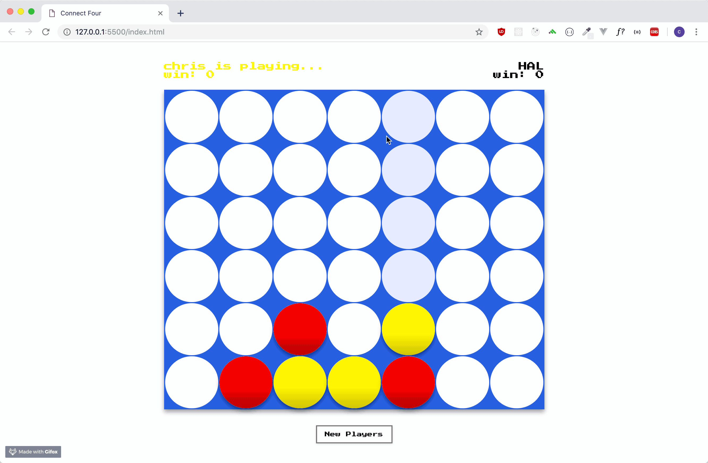
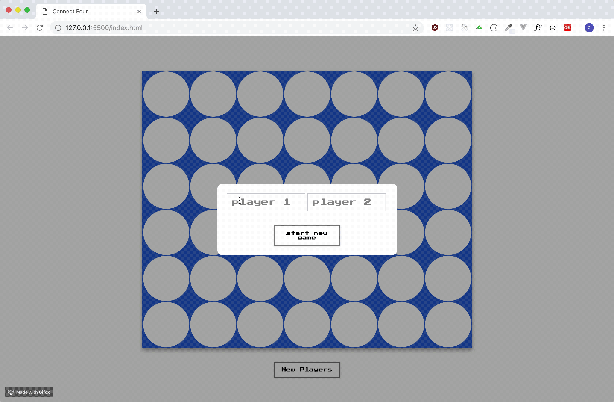
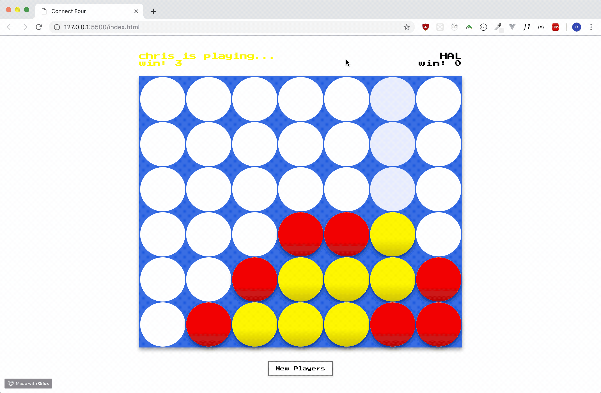

# Connect 4

This is a connect 4 game that allow two users to play againt each other or one player to play against the computer.

## Getting Started

If you want to play againt the computer, you just need to name player 2 : HAL.

Otherwise, just have fun with your friend trying to kick their asses...

### Installing

to install the game on your local machine just clone the repository to your local machin and open the index.html file in your prefered browser.

## Built With

* JavaScript
* Jquery
* CSS
* HTML

## Authors

* **Christophe Johanny** - *Initial work* - [st-jon](https://github.com/st-jon)

## License

This project is licensed under the MIT License - see the [LICENSE.md](LICENSE.md) file for details

## Super secret tip...

* If you want to beat anyone, by looking the code you should be able to find a cheat code that will give you super power....

